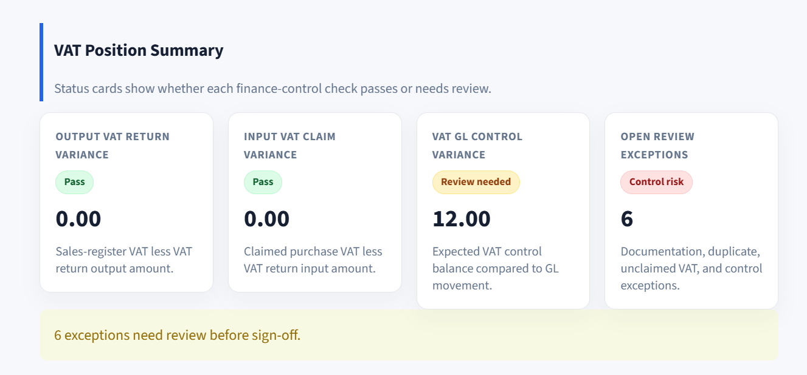
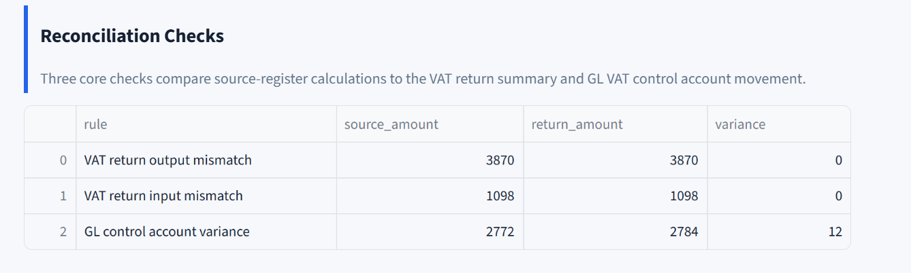
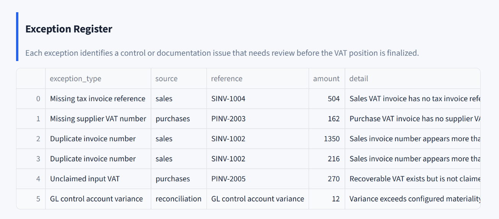
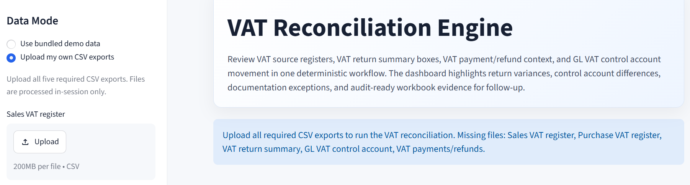
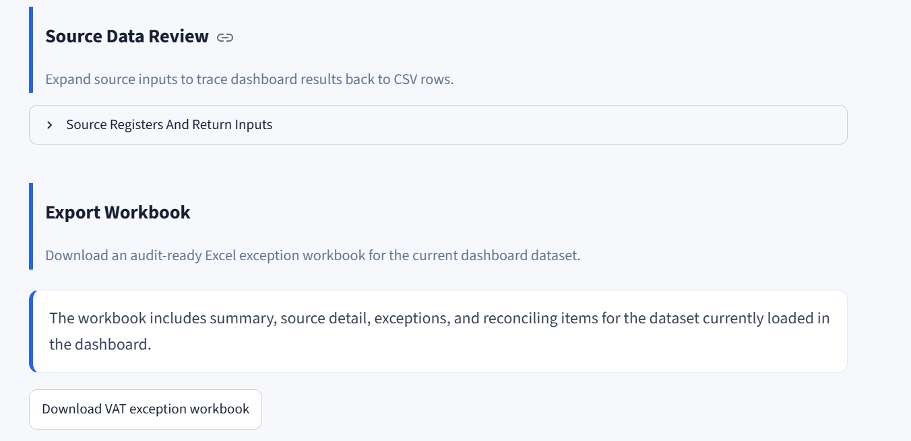

# VAT Reconciliation Engine

[](https://github.com/Chezhira/vat-reconciliation-engine/actions/workflows/ci.yml)

[](https://github.com/Chezhira/vat-reconciliation-engine/tags)
[](https://vat-reconciliation-engine.streamlit.app/)

Live app: [vat-reconciliation-engine.streamlit.app](https://vat-reconciliation-engine.streamlit.app/)

A finance controls application for reconciling VAT source registers, VAT return
summaries, VAT payments/refunds, and GL VAT control account movements.

The engine validates input schemas, calculates expected VAT positions,
identifies reconciliation differences, flags documentation and control
exceptions, and exports an audit-ready Excel workbook for follow-up review.

This public portfolio version includes a bundled synthetic demo dataset. Users
can also test the engine with their own CSV exports by replacing the sample
files with data that follows the documented schema.

## Dashboard Preview

The Streamlit dashboard is designed for a finance reviewer to move from VAT
position summary to exception follow-up without losing the audit trail.

**Dashboard summary:** high-level VAT variances, exception count, and review
status cards for sign-off triage.



**Reconciliation checks:** output VAT, input VAT, and GL VAT control account
checks shown as a concise control review table.



**Exception register:** transaction-level follow-up items for documentation,
duplicates, unclaimed input VAT, and control-account variance.



**Upload mode:** reviewer-facing CSV upload path for testing exports that follow
the documented schema.



**Workbook download:** in-dashboard export action for the audit-ready exception
workbook.



## Why This Matters

VAT returns are often prepared from several sources: ERP tax reports, invoice
registers, spreadsheets, GL control accounts, and payment or refund records.
Those sources do not always agree.

Differences may come from timing, missing invoices, incorrect tax codes,
unclaimed input VAT, missing supplier VAT numbers, duplicate invoices, or GL
posting issues. A repeatable reconciliation layer improves control quality,
audit readiness, and review discipline before a VAT return is finalized.

## What The Tool Does

- Ingests VAT source registers, VAT return summary data, GL VAT control account
  data, and VAT payment/refund records.
- Validates files against configured schemas.
- Applies deterministic VAT reconciliation checks.
- Flags control and documentation exceptions.
- Produces a VAT position summary.
- Exports an Excel exception workbook.
- Provides a Streamlit dashboard for review.

## Current Release

The v0.1 release includes deterministic pandas reconciliation logic,
config-first VAT rates, mandatory fields, materiality thresholds, VAT return box
mapping, a Streamlit dashboard, Excel workbook export, and CI checks with ruff,
pytest, and a sample-data smoke test.

The repository does not include LLM calls, OCR, APIs, authentication, databases,
live tax authority submission, or jurisdiction-specific compliance
certification.

## Data Safety And Demo Dataset

This repository ships with synthetic demo data so the project can be reviewed
publicly without exposing employer, client, supplier, tax, bank, or commercially
sensitive records.

To test the engine with your own data, replace the CSV files in `data/sample/`
with exports that follow the same column structure and schema expectations. The
current release supports file replacement using the documented schema.
Interactive upload support is a planned enhancement.

## Inputs

The engine reads these files from `data/sample/`:

- `sample_sales_vat_register.csv`
- `sample_purchase_vat_register.csv`
- `sample_vat_return.csv`
- `sample_gl_vat_control.csv`
- `sample_vat_payments_refunds.csv`

Validation rules, mandatory fields, VAT rates, materiality thresholds, and VAT
return box mappings are configured in `config/vat_generic.yml`.

## Reconciliation Workflow

The current workflow is:

1. Load CSV exports.
2. Validate source files against configured schemas.
3. Calculate VAT positions from source registers.
4. Compare calculated VAT to VAT return summary boxes.
5. Reconcile expected VAT control balance to GL movement.
6. Generate exceptions and reconciling items.
7. Review results in Streamlit.
8. Export the Excel workbook.

## Reconciliation Checks

- Output VAT: sales VAT register compared to the VAT return output amount.
- Input VAT: purchase VAT register compared to the VAT return input claim.
- GL VAT control account: expected VAT balance compared to GL movement and
  control account position.

## Sample Exceptions

The bundled demo dataset currently produces six exceptions:

| Exception type | Example reference | Area | Amount |
| -------------- | ----------------: | ---- | -----: |
| Missing tax invoice reference | `SINV-1004` | Sales | 504.00 |
| Missing supplier VAT number | `PINV-2003` | Purchases | 162.00 |
| Duplicate invoice number | `SINV-1002` | Sales | 1,350.00 |
| Duplicate invoice number | `SINV-1002` | Sales | 216.00 |
| Unclaimed input VAT | `PINV-2005` | Purchases | 270.00 |
| GL control account variance | Reconciliation variance | GL control | 12.00 |

## Outputs

- Streamlit dashboard for reviewing VAT variances, exceptions, and source
  registers.
- Excel workbook:
  `outputs/sample_vat_recon/sample_vat_exception_workbook.xlsx`.

The workbook supports review of the VAT summary, output VAT detail, input VAT
detail, GL movement, payments/refunds, exceptions, and reconciling items.

## Demo Walkthrough

For a reviewer-oriented walkthrough of the input files, reconciliation flow,
sample exceptions, workbook review path, and Streamlit dashboard review path,
see [docs/demo_notes.md](docs/demo_notes.md).

## Quick Start

```powershell
python -m venv .venv
.\.venv\Scripts\python.exe -m pip install -r requirements.txt
.\.venv\Scripts\python.exe -m pip install -e ".[dev]"
```

Run the dashboard:

```powershell
streamlit run app.py
```

Run the smoke test:

```powershell
python scripts\run_sample_smoke.py
```

## Quality Checks

```powershell
python -m ruff check .
python -m ruff format --check .
python -m pytest -q
python scripts\run_sample_smoke.py
```

## CI

GitHub Actions runs ruff, format check, pytest, and the sample-data smoke test
on push and pull request.

## Portfolio Signal

This project demonstrates VAT reconciliation judgment, GL control account
discipline, exception reporting, audit trail thinking, config-driven finance
automation, test-covered deterministic logic, and CI/CD discipline.
